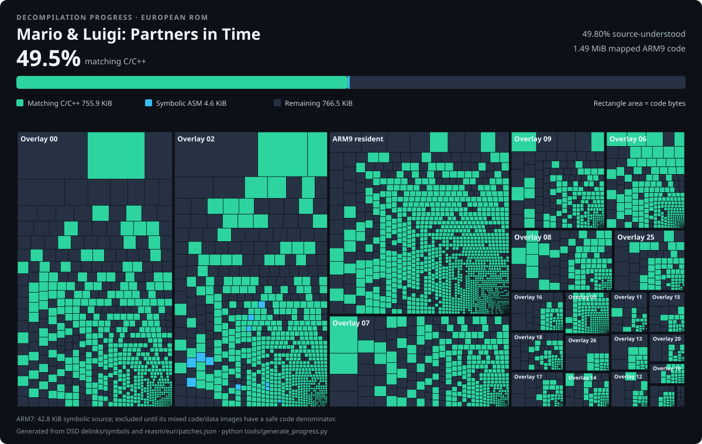

# Mario & Luigi: Partners in Time decompilation and reassembly

This repository is a work in progress. Its long-term goal is a fully
source-buildable, mod-friendly reconstruction of the Nintendo DS game, not a
collection of binary patches.

No ROM, generated machine-code dump, graphical/audio asset, or opaque extracted
game binary belongs in this repository. Reconstructed source plus understood,
editable non-graphical text and data tables are versioned. You must supply your
own matching ROM for verification and packaging. Generated sources and build
outputs stay below `build/`, which is ignored by Git.

## Decompilation progress

[](docs/PROGRESS.md)

The headline percentage counts byte-matching C/C++ against mapped ARM9 code.
Maintained symbolic assembly is shown separately and does not count as decompiled
source.
See the [progress methodology and regeneration instructions](docs/PROGRESS.md).

## Current status

- The upstream `dsd` project layout covers the European and US ARM9, ITCM,
  DTCM, and ARM9 overlays.
- The bootstrap reassembler covers ARM9, ARM7, and every overlay entry directly
  from the NDS header and FAT.
- The verified European ROM round-trips through 39 generated assembly modules
  and LLVM with zero differing bytes.
- The raw generated sources initially use `.word` and `.byte`; they are a
  lossless starting representation, not a claim of semantic decompilation.
- Every ARM9 and ARM7 runtime image now relinks as 43 components and 420
  independent, fixed-address ELF units.
- Decompilation is now proceeding across every real ARM9 overlay, with small,
  self-contained leaf routines taken first instead of waiting for one gameplay
  subsystem to be complete. The first cross-overlay pass adds 49 byte-matching
  C functions (2,264 bytes): field-entity lifecycle helpers in overlay 0,
  resource ownership and DS 2D-display helpers in overlay 5, enemy selection
  and value-scaling helpers in overlay 10, and attack-phase state helpers in
  overlay 21. The maintained [overlay map](docs/research/OVERLAY_MAP.md) records
  proven roles and the next triage targets without guessing at unknown modules.
- The next overlay pass adds fourteen more matching C functions (1,460 bytes)
  from special-attack overlays 12 and 20. They expose party-formation and
  animation state, the original four-member action-order shuffle, paired
  scene-object setup/cleanup, finish and mode transitions, actor-position
  restoration, and target-relative vertical-arc startup. The exact Bros. item
  identities remain conservatively unnamed until confirmed at runtime.
- Overlay 11 now contributes another seven matching projectile-attack helpers
  (708 bytes): level-scaled setup for scene object 40, animation timing,
  actor-contact testing, bounded motion, finish animation, and actor-resource
  restoration. Its shell-like behavior is documented without assigning an
  unverified Bros. item name.
- Overlay 13 contributes seven matching special-attack helpers (948 bytes).
  They advance motion tuning, prepare and align a paired scene-object setup,
  start its retreat and vertical-entry paths, classify a vertical angle into
  animation bands, and keep the active model animation synchronized. The
  original C++ virtual dispatch is represented directly instead of hidden in
  hand-written assembly.
- One hundred and thirty-four named overlay-2 battle functions are maintained symbolic ARM source,
  together with the resident item-value calculator they call.
  They cover task enqueueing, intrusive task lists and pools, actor lookup,
  packed object-ID resolution and ordinary object-data loading,
  live actor/resource binding, both base and fully modified POW/DEF/level damage
  formulas, HP/KO updates, the complete enemy and party hit/popup/effect paths,
  status removal/reset, healing, revival, cures, stat items, and equipped
  healing-badge boosts. Every function matches its original bytes.
- The ROM-backed battle-AI analyzer inventories all 182 dispatcher opcodes,
  their handler addresses, shared entries, command-record offsets, and direct
  call edges without copying ROM bytes into the repository.
- The complete `0x170`-byte resident ARM7 startup is maintained ARMv4T source:
  four functions plus its NitroSDK module parameters, all matching exactly.
- ARM7 autoload 0 now has exact symbolic sources for `ARM7_Main` and the
  NitroSDK `OS_IrqHandler`, including the cross-autoload call and IRQ/thread
  state references. `OS_Init`, the IRQ-table and arena initializers, IRQ-mask
  controls, `OS_SetIrqFunction`, and the `SVC_Halt` interworking thunk are
  symbolic as well. Thread bootstrap,
  switch-callback registration, CPSR/IRQ mask control, reset coordination, and
  the `SVC_Halt`/`SVC_WaitByLoop` Thumb wrappers, and `MI_StopDma` are also
  maintained. Lock initialization, lock-ID allocation, Game Pak lock
  primitives, PXI FIFO initialization and public APIs, the hardware-timer tick
  subsystem, alarm initialization, and the public Game Pak initializer are
  symbolic too. Callback-backed VBlank, timer, and DMA IRQ dispatch is also
  maintained with the SDK handler names, along with the nested scheduler
  enable/disable counter, alarm-backed thread sleep, priority updates, and
  context switching. Direct and wait-queue sleep/wakeup primitives are
  symbolic as well, including thread creation, current-thread resource
  release, exit, scheduler-list maintenance, ID allocation, and CPU context
  save/load. The blocking/nonblocking message-queue API is maintained too.
  Recursive mutex ownership and its thread wait queues are symbolic as well.
  The ARM7 heap allocator is maintained too, including arena initialization,
  allocation/free, consistency checks, and its ordered free-list helpers.
  V-count alarms now have symbolic frame tracking, IRQ dispatch, cancellation,
  one-shot/periodic setup, and sorted queue maintenance.
  DMA waiting and the ARM7 CPU fill/copy primitives are maintained as well.
  Periodic ARM7 sampling of the X/Y buttons and hinge state is symbolic too.
  Sound output, sleep, bias, master-enable, and shutdown controls are symbolic.
  Sound-channel pan, volume, timer, surround, PCM, PSG, and noise setup follows.
  Sound random, sine, logarithmic volume, and pitch/timer helpers are symbolic.
  The sound thread, message queue, interval alarm, and guarded startup are now
  symbolic too, including PiT's queue-overflow warning path.
  LFO modulation, PCM-wave invalidation, and hardware-channel locking are
  maintained as well.
  Extended-channel allocation, ADSR progression, PCM/PSG/noise voice startup,
  mixer calculations, and staged register updates are symbolic too.
- Maintained high-level source now includes the original Nitro math unit and
  six byte-matching resident VM functions used by battle and field script
  runtimes: the run loop, all eleven jump conditions, the command decoder, and
  the complete 51-command core executor plus its variable reader and writer.
  They expose yielding, call and loop stacks, control flow, integer and
  fixed-point arithmetic, descriptor flags, signed literals, VM-local state,
  save-data words/bytes/flags, and overlay extension hooks behind the editable
  BAI command format. Overlay 2's matching extension now exposes battle-script
  owner/target actor IDs and its 32 shared integer variables as editable C.
  High-level source also includes
  two hundred and six byte-matching overlay-2 battle functions: forty-four
  battle-AI/VM/target/state helpers, the eight-function generic task-pool unit,
  and four actor HP/lookup
  helpers plus status eligibility, base damage, the central HP/KO primitive,
  and party-healing feedback, plus the save-backed experience and level-
  threshold update. Three reward-counter effect functions, eight
  scene-object state/model/motion helpers, two DS square-root wrappers, a
  battle-relative position transform, both battle-animation setters, and the
  complete five-function hit-descriptor setup layer are high-level source too.
  The seven-function object-resource control block now exposes visual-resource
  binding, enemy stat initialization, pending-load checks, duplicate-load
  suppression, slot configuration, and heap-backed buffer allocation.
  Two matching texture helpers encode 8-1024-pixel S/T dimensions for the DS
  `G3_TEXIMAGE_PARAM` register.
  Four matching battle-interface helpers now select the active character's
  command menu, resolve ordinary and Bros. item-name resources, translate
  enemy stat/name IDs, and refresh the target-label layer. A matching enemy
  accessor exposes the stat record already bound to each loaded enemy actor.
  Two matching interface-layer helpers suppress redundant resource changes,
  pack layout and update modes into a pooled request, and queue the
  asynchronous layer refresh. The layer structure now names its pixel buffer,
  resource cursor, asset table, layout fields, and upload-control flags.
  Three matching level-up bonus helpers map the eight-phase roulette to a
  1-6 reward, move the stopped result object, and count the selected points
  into HP, POW, DEF, SPEED, or STACHE before synchronizing the active save
  stats. Their typed 36-byte party record exposes both base and active stats.
  Two matching growth-display helpers also derive the four automatic stat
  gains from cumulative character growth tables and start the five animated
  result rows at three-frame intervals.
  Eight more matching task helpers expose double-buffered battle-background
  loads/fades and the field-asset reload used when leaving battle.
  Eleven matching raster-effect functions expose finite and persistent
  scanline interpolation, the object-data-51 fade/load/fade transition, and
  the accelerating view-relative particle task used by battle-AI opcodes
  `0xC1`, `0xC2`, and `0xE8`.
  Seven matching grid-transition task functions initialize the two animation
  phases, wait on their shared angle/velocity state, coordinate battle-background
  toggling and asynchronous display capture, and retire the tasks together with
  runtime flag `0x40` when their 8-by-6 DS-geometry passes finish.
  Eleven adjacent matching line-transition functions manage two 32-strip wipe
  phases and a captured intermediate phase. Their typed state exposes the shared
  position/velocity arrays, staggered frame counter, capture configure/reset
  chain, and the child task that synchronizes the preceding grid transition.
  Seven matching cylinder-transition functions expose the ordinary and
  save-selected dual-screen paths, including VCount IRQ display swapping and
  clamped capture intensity. Two matching curtain-transition functions then
  advance and retire the following 50-column geometry wipe.
  Six matching cylinder-wipe callbacks implement the adjacent reveal,
  optional dual-screen rotation, display restoration, and captured finish
  sequence. Eight matching iris-transition callbacks then drive both radial
  phases and their asynchronous display-capture bridge over 64-frame passes.
  The adjacent six-function common-asset loader is matching C as well: it
  opens the battle archive, reads and relocates its offset table, selects the
  localized entries, and fills the twenty-one-slot runtime pointer table.
  Eight matching interface-asset functions then load the shared and localized
  UI resources, initialize four editable 2D-layer descriptors, and populate
  the two selectable screen-resource slots.
  Six adjacent action/party script-loader functions resolve packed object-data
  IDs, stream the selected BAI payloads into their dedicated buffers, and start
  the corresponding action or fixed party VM once asynchronous reads finish.
  Seven matching AI-system functions initialize the shared VM, register the
  battle opcode dispatcher, open all fourteen AI archives, initialize the task
  pools, and expose the special-handle reload plus actor-lock control helpers.
  Four adjacent actor/script commands test every hit lock, remove an enemy with
  optional damage feedback, configure a model animation layer through its
  original virtual interface, and test the three typed handle families.
  The following global-property reader is matching C and documents all values
  exposed by battle-AI opcode `0x46`, including actor selection, map/background
  state, fade progress, shared masks, and runtime flags. Its paired opcode
  `0x47` setter is fully structured C but remains unlinked while its final
  fade-toggle block has an eleven-instruction register-allocation mismatch.
  The 3,548-byte actor/object property reader is now matching C as well. It
  turns battle-AI property IDs into typed HP, POW, DEF, SPD, position,
  animation, resource, hit, transition, and scene/model state reads while
  preserving conservative offset names for fields not yet proven in play.
  Its 4,268-byte writer is matching, linked C too. Battle-AI opcode `0x4E`
  reaches it 6,042 times across the extracted BAI corpus to change those
  stats, HP, positions, animation/model flags, hit state, formation fields,
  and scene-operation channels through the same documented property ABI.
  The neighboring slot-swap routine is matching C as well. It exchanges scene
  objects between the field and actor slot banks, repairs both object IDs, and
  preserves the slot-specific actor flag when party or enemy entries trade
  places.
  The four-function scene-animation unit is matching C++ as well. It exposes
  component selection, party/enemy idle variants, linked-party formation
  offsets, resource-driven model replacement, and the renderer notification
  path while retaining the original model virtual calls.
  The adjacent seven-mode movement dispatcher is matching C and routes scene
  objects through immediate, relative, absolute, target-relative, ballistic,
  and accelerated motion primitives.
  Four matching enemy-data functions select one editable 44-byte `BDataMon`
  record, load its referenced object payload into a typed 0x200C-byte request,
  and fix its stat/object pointers after the asynchronous reads complete.
  The matching object-resource copier performs overlap-safe payload copies,
  rebases five embedded component pointers, preserves destination ownership
  fields, and schedules the resource upload when required. Its adjacent
  matching wrapper queues a new resource ID and records the pending-load flag.
  The preceding two matching callbacks reconstruct an object resource one
  component per task tick, expose the original C++ model interface and stream
  writer, build its component-offset table, and finalize the spare stream
  workspace after the last component.
  Ten following matching callbacks set up the resource's body, tail, and
  optional texture requests, drive both staged decode waits, queue the final
  transfer, and select sprite and texture uploads. The completion callback
  either clears the processing state or returns to the rebuild pipeline when
  a newer load is pending.
  The remaining game
  functions stay in symbolic assembly until an equivalent C translation
  reproduces their original code and layout. The adjacent two-function party
  formation/resource transition is also readable C; it remains on its original
  reference object until the last Metrowerks register-allocation differences
  are resolved.
- The European editable-data project covers 21 multilingual MFset archives,
  10,510 battle/field dialogue strings, and all 98 enemy-stat records. Its
  inverse encoders also cover all 765 treasure records, reproduce every covered
  binary byte for byte before edits, and support length-changing text. Four
  shop datasets and 99 item-master records are editable through validated
  copies of their overlay-9 and resident-ARM9 tables. All 14 battle-scenario
  and enemy-AI archives are decoded into 242 scripts and 129,127 editable VM
  commands; their assembler preserves private, not-yet-understood tail data
  without checking opaque bytes into Git.

See [`docs/REASSEMBLY_PLAN.md`](docs/REASSEMBLY_PLAN.md) for the staged route
from the fixed-layout bootstrap to a relocatable, size-extensible mod SDK.
[`docs/DECOMPILATION_STYLE.md`](docs/DECOMPILATION_STYLE.md) records the
matching, source-organization, naming, and runtime-evidence rules for readable
high-level code.
The generated [`docs/research/BATTLE_AI_OPCODES.md`](docs/research/BATTLE_AI_OPCODES.md)
provides a compact navigation index for the large enemy-script dispatcher.
[`tools/ida/README.md`](tools/ida/README.md) documents the reproducible IDA
9.1/9.2 ARM32 database imports and batch Hex-Rays helpers for the resident ARM9
and every overlay.
[`docs/DATA_MODDING.md`](docs/DATA_MODDING.md) documents editable text/stats,
control tokens, validation, and ROM packaging.

## Verified European ROM

```text
Game code: ARMP
SHA-1:    ba4ec2f99b4f2e0047601552bccf00aa73e28701
SHA-256:  8b16b1f1f0aca4a78dae540be56a219adbde6ee3f1cd33d3f0fba777de01d6a3
```

## Bootstrap reassembly

Requirements:

- Python 3.11 or newer;
- LLVM tools `llvm-mc`, `ld.lld`, and `llvm-objcopy` on `PATH`;
- your own matching NDS ROM.

Check the environment:

```powershell
python .\tools\reassembly.py doctor `
  --version eur `
  --rom 'C:\path\to\your\PiT.nds'
```

Generate local assembly, assemble every native module, and require a completely
matching output ROM:

```powershell
python .\tools\reassembly.py all `
  --version eur `
  --rom 'C:\path\to\your\PiT.nds' `
  --output '.\build\PiT_eur_reassembled.nds' `
  --require-matching
```

Generated assembly is written to `build/reassembly/eur/generated/`. Editing a
generated module and running the `build` command produces a fixed-size code
mod. A maintained whole-module source with the same filename under
`reasm/eur/modules/` overrides the generated source.

This bootstrap deliberately refuses size changes and modifications to the
encrypted DS secure area. Those require the relocatable linker and encryption
stages described in the plan.

## Sectioned native-code relink

The Stage-1 linker supports resident ARM9, ITCM/DTCM, all ARM9 overlays,
resident ARM7, and both ARM7 autoload images. It validates both CPUs' serialized
autoload layouts, splits every component at verified section and
maintained-source boundaries, and links each one for its correct architecture
and runtime address:

```powershell
python .\tools\relink_native.py `
  --version eur `
  --rom 'C:\path\to\your\PiT.nds' `
  --output-rom '.\build\PiT_eur_native_relinked.nds' `
  --require-matching
```

The verified pass covers 43 components, 420 section units, 258 maintained
units, and 31,138 currently known relocations with zero differing bytes. To
iterate on one CPU family or overlay, use `tools/relink_arm7.py`,
`tools/relink_arm9.py`, or `tools/relink_overlay.py`. ROM-derived fallback
units, binaries, and JSON build reports remain below ignored `build/` paths.

The resident ARM7 startup is fully symbolic source. Its two large autoloads are
still conservatively marked as mixed code/data images; 118 proven autoload-0
units are maintained source and 1,558 autoload relocations are mapped, but
the upstream project contains no further ARM7 analysis. See
[`docs/research/ARM7_MAP.md`](docs/research/ARM7_MAP.md) for the exact confidence
boundary.

## Existing `dsd` matching-decompilation build

The upstream build remains useful as the byte-matching oracle. Put the matching
ROM in `extract/` under the filename documented there, then generate the Ninja
build with:

```powershell
python .\tools\configure.py eur
ninja
```

The two pipelines have different purposes: `dsd` supplies delinked objects,
relocations, linker layout, and `objdiff`; `tools/reassembly.py` supplies a
complete local assembly representation from day one.

The final `dsd` link substitutes compiled C only for translation units listed
in `config/eur/arm9/linked_sources.txt`. Every other C file remains available
to `objdiff`, while its original delinked object is kept in the ROM. Add a unit
to this list only after its code, size, and function order match. Experimental
edits to an already listed unit are intentionally linked even when they no
longer match; this is what makes source-level test mods possible.

## Build and run from CLion

The shared `Build and Run EUR NDS` run configuration regenerates `build.ninja`,
builds the editable C/assembly sources, packages `PiT_eur.nds` in the repository
root, and launches it in DeSmuME. Put your own matching ROM at
`extract/baserom_PiT_eur.nds` first; neither the private input nor the built ROM
is tracked by Git.

The same run configuration also detects `data/eur/project.json` and rebuilds
the editable text and enemy-stat documents into a staged NitroFS before final
packaging. It never changes the private extraction. Use `-DisableDataMods` with
`tools/build_nds.ps1` when an unmodified data tree is desired.

Select `Build and Run EUR NDS` in CLion's run-configuration menu and press Run.
Its configured emulator is
`D:\NDS\DeSmuME\DeSmuME_0.9.13_x64.exe`. The configuration deliberately builds
the `rom` target without enforcing a match, so experimental code changes still
produce a testable image when their translation unit is listed as described
above. Use `ninja check` when you want to verify
byte-identical reconstruction separately. The wrapper also restores the
fixed-layout secure-area and header CRC fields that `dsd` does not preserve; it
refuses any unexpected header difference. A build without launching an
emulator is available in a terminal with:

```powershell
powershell -NoProfile -ExecutionPolicy Bypass -File .\tools\build_nds.ps1
```
